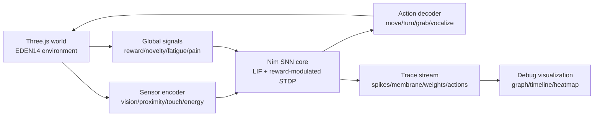

# EDEN14 Three.js Environment Integration Plan

作成日: 2026-06-19

## 現状の答え

現在のNim試作は、実行中にSTDPでシナプス重みを更新するため、最小限の逐次学習は可能である。

ただし、身体性を持つ生命体としてThree.js環境上で動かすには、単純なSTDPだけでは足りない。環境からの感覚入力、運動出力、報酬、新奇性、疲労、損傷、空腹などのグローバル信号をSNNへ戻し、学習率や可塑性を調整する必要がある。

今回追加した方針:

- STDPはオンライン更新のまま維持する。
- `rewardSignal` と `learningRate` を導入し、報酬変調STDPの最小形にする。
- Three.js側とはJSONイベントで疎結合にする。

## 接続アーキテクチャ



## Three.js側から送る入力

Three.jsの生命体ごとに、毎フレームまたは固定tickで以下のような観測を送る。

```json
{
  "kind": "observation",
  "agent_id": "agent-001",
  "t_ms": 1234,
  "body": {
    "position": [1.2, 0.0, -4.1],
    "velocity": [0.02, 0.0, -0.01],
    "energy": 0.82
  },
  "sensors": {
    "target_left": 0.0,
    "target_right": 0.7,
    "collision": 0.0,
    "food_near": 0.3,
    "danger_near": 0.0
  },
  "global": {
    "reward": 1.1,
    "novelty": 0.4,
    "fatigue": 0.2
  }
}
```

初期実装では `sensors` の値をそのままSNNニューロンへの外部電位注入として扱う。後続で、視覚、音、触覚、内部状態を専用エンコーダへ分ける。

## Nim SNN側から返す出力

SNNは発火イベントから運動ニューロンを集計し、Three.js側へ行動として返す。

```json
{
  "kind": "action",
  "agent_id": "agent-001",
  "t_ms": 1235,
  "move": [0.1, 0.0, -0.02],
  "turn": 0.05,
  "intent": "approach",
  "confidence": 0.62
}
```

同時に、可視化用には以下をストリームする。

```json
{"t_ms":1235,"kind":"spike","neuron":5,"label":"motor:right","value":1.0}
{"t_ms":1235,"kind":"weight","synapse":3,"value":0.61,"meta":{"rule":"on_post","plasticity_scale":0.94}}
```

## 最小の生命体モデル

最初に作るべきSNN身体モデル:

- 感覚: `target_left`, `target_right`, `collision`, `energy_low`
- 中間: `approach`, `avoid`, `rest`
- 運動: `move_left`, `move_right`, `move_forward`, `stop`
- グローバル信号: `reward`, `fatigue`, `novelty`

学習ループ:

1. Three.js環境が観測を送る。
2. SNNが1tick進む。
3. 発火した運動ニューロンから行動を生成する。
4. Three.js環境が身体を動かす。
5. 目標に近づく、衝突する、エネルギーを失うなどの結果から報酬を計算する。
6. 報酬をSNNへ戻し、次tickのSTDP可塑性へ反映する。

## ローカルソースを受け取った後に見る場所

EDEN14のソースがこのワークスペースに置かれたら、まず以下を確認する。

- Three.js sceneの初期化箇所。
- animation loop または physics tick。
- avatar/entity/agent の管理クラス。
- 入力、移動、衝突判定、カメラ追従の実装。
- Vite/Next/webpackなどの実行方式。

その後、SNN接続は以下の順で入れる。

1. 既存のエージェント更新ループに `collectObservation(agent)` を追加する。
2. WebSocketまたはHTTP streamingでNimプロセスへ送る。
3. `action` レスポンスでエージェントの移動・回転・表情・音を更新する。
4. SNN traceをデバッグパネルに表示する。

## 今回のNim試作

- `src/snn/core.nim`: 逐次STDP、報酬信号、学習率、学習ON/OFFを持つ。
- `src/snn/embodied_demo.nim`: 1次元の身体位置、目標、報酬を使った身体性デモ。
- `EDEN/src/snn/lif.ts`: Three.js上で即時に試せるブラウザ内SNN。Nim版と同じく、LIF、遅延シナプス、報酬変調STDP、trace eventを持つ。
- `EDEN/src/Game.tsx`: Debug Info内の `SNN Life` トグルで、自律生命体をサーバー登録されたオブジェクトとして生成する。

## EDEN内SNN Lifeの現在仕様

- 複数モデル: `Parallel models` で最大8個体を同時生成する。各個体は `snn-life-001` からのIDを持ち、別々のSNNネットワークとして同時に逐次学習する。
- 永続化: 学習済み膜電位、STDP trace、シナプス重み、報酬信号は `eden14:snn-life:v1:<creature_id>` のlocalStorageキーに個体別保存する。
- ダウンロード: Debug Infoで個体を選択し、`Download selected SNN` から保存済みsnapshotを `.edensnn` として書き出す。ファイルは `EDENSNN1` マジックヘッダ、payload長、SNNモデルpayloadで構成する。各モデル要素に `creatureId`, `storageKey`, `snapshot` を含める。
- 分析ダッシュボード: `/snn-dashboard` で `.edensnn` を読み込み、ニューロン状態、膜電位、refractory、シナプス重み、STDP trace、重み分布を確認できる。
- SpikingMamba反映: `EDEN/src/snn/lif.ts` は `si-lif` モードを持ち、`±D` の符号付き整数スパイクを発火できる。現行の新規SNN Lifeは `neuronType: "si-lif"`, `spikeRangeD: 4` を使う。
- 効率計測: snapshot v2は `spikeStats` を保存する。Dashboardでは発火率、正/負スパイク量、Sparse AC ops、Dense MAC baseline、推定エネルギー倍率を表示する。
- ブラウザ言語学習: `browser-snn-lab/` はEDENとは独立した学習環境である。ブラウザ操作種別、観測テキスト、報酬をSNN刺激へ変換し、単語ニューロンと隣接関連シナプスを逐次学習する。外部サイトDOMはブラウザ制約で直接読めないため、初期版ではiframe表示、サンプルページ、観測テキスト入力を使う。
- 言語SNNモデル: `browser-snn-lab` から `browser-language` の `.edensnn` をエクスポートできる。EDENの `/snn-dashboard` は身体SNNとブラウザ言語SNNの両方を読み込んで分析できる。
- Chrome拡張学習環境: `chrome-snn-extension/` は通常のWeb閲覧そのものをSNNの身体環境として扱う。content scriptで実ページの可視テキスト、クリック、スクロール、入力、選択範囲を観測し、service workerでブラウザ言語SNNを逐次更新する。学習状態は `chrome.storage.local` に保存し、サイドパネルから `.edensnn` としてダウンロードできる。
- メディア学習: Chrome拡張は `video` / `audio` 要素も観測する。再生、一時停止、シーク、再生速度、音量、再生中サンプル、終了イベントを刺激化し、進捗、音量、ミュート、動画サイズ、周辺テキスト、取得可能な字幕cueを `media:*` トークンとしてSNNへ入力する。現時点では音声波形の文字起こしや映像フレーム解析は未実装で、まずはブラウザが公開しているメディア状態を逐次学習する。
- 脳型学習近似: Chrome拡張のSNNは報酬だけでなく、新奇性、注意、覚醒、気分安定、疲労を `dopamine` / `acetylcholine` / `norepinephrine` / `serotonin` / `fatigue` として持つ。これらでSTDP可塑性をゲートし、発火しすぎるニューロンの閾値を上げる恒常性可塑性、高顕著性記憶を一定ステップごとに固定化する睡眠リプレイ風処理、安定化済み記憶を上書きされにくくする保護を行う。
- 遅延報酬: Chrome拡張SNNは即時報酬に加えて eligibility trace を持つ。最近活動したシナプスを `eligibility.synapses` に保存し、後から `click`, `selection`, `input`, `media_ended`, 長時間視聴後の `media_pause` などの成果イベントが来た時、過去の原因候補へ報酬を配分して重みを更新する。これにより、スクロールして読んだ後のクリック、動画視聴後の完走、読解後の選択といった時間差のある学習を扱う。
- モラル/道徳評価: SNN固有の成熟した道徳学習研究はまだ限定的なため、機械倫理と安全な強化学習の reward shaping / constraint の考え方をSNN報酬系に写像する。Chrome拡張SNNは危害、プライバシー、欺瞞、同意、向社会性を内的価値信号として評価し、報酬、可塑性、遅延報酬へ反映する。個人情報や秘密情報は保存前に `[redacted-sensitive]` へ置換し、具体値ではなく `moral:privacy-risk` などの抽象トークンを学習する。
- 学習設定: Chrome拡張のサイドパネルに `Learning Settings` を持つ。入力値の扱いは `metadata` / `text` / `full` から選べる。センシティブ情報は `redact` / `abstract` / `full` を選べる。モラル評価は `off` / `observe` / `shape` / `constraint` で学習への効かせ方を切り替える。個人情報やパスワードを価値の高い情報として扱いたい場合は `Privacy sensitivity` と `Sensitive reward` を上げる。
- 性能計測とWebGPU: Chrome拡張のサイドパネルは `Model size`, `CPU load`, `Step time`, `Avg step`, `Backend`, `WebGPU` を表示する。CPU loadはOS全体ではなく拡張内の学習ステップ時間からの推定値である。CPU側は語彙/シナプス検索をMapインデックス化し、WebGPUが利用可能な場合はアクティブ語彙ニューロンの膜電位更新をcompute shaderへ逃がす。`Compute backend` は `auto` / `cpu` / `webgpu` を選択できる。
- 学習済みデータの検査: `snn-chat-lab/` は `.edensnn` 内の `browser-language` モデルを読み込み、入力トークンから語彙ニューロンを発火させる。返答では会話文を合成せず、閾値を通過した `Neuron` カラム値だけを連結した `SNN_NEURON_TEXT`、発火表、シナプス経路、`spikeEvents` / `moduleTriggers` を表示する。チャット入力は意味語を中心に既存発火ニューロンとの結合を強化し、更新済みモデルは `.edensnn` として再エクスポートできる。
- EDEN側への反映: `EDEN/src/snn/lif.ts` の身体SNN Lifeにも、Extension側で導入した神経修飾、eligibility trace、遅延報酬、睡眠リプレイ風固定化を追加した。身体刺激からの報酬だけでなく、後から来る成果を過去の運動/感覚シナプスへ割り当て、強い経路を安定化する。
- 報酬: プレイヤー接近報酬は使わない。SNN Lifeの身体から得た刺激だけを報酬に使う。刺激源は既存の自律オブジェクト、shader/material/frequency、PostFX、雨、衝突である。
- 身体性: SNN Lifeは既存オブジェクトのサイズ情報を使ってXZ平面の当たり判定を行い、衝突を `sensor:collision` と報酬ペナルティへ戻す。
- 身体ジオメトリ学習: SNN Lifeは `SnnBodyState` として `widthX`, `heightY`, `depthZ`, `asymmetry`, `jointPhase`, `jointSwing`, `limbReach`, `rigWeight`, `deformation`, `gaitDrive`, `mass`, `drag` を持つ。これらは専用学習器ではなく、`sensor:body_compact`, `sensor:body_extended`, `sensor:joint_motion`, `sensor:rig_load` と `motor:body_expand`, `motor:body_contract`, `motor:joint_swing`, `motor:stabilize_pose` のニューロン/シナプスだけで更新される。
- 形状と物理挙動の閉ループ: 身体ジオメトリは次tickの感覚電流、移動速度、旋回、衝突半径、報酬へ戻る。安定した形状・関節駆動で移動効率が上がると報酬が増え、衝突や過変形では報酬が下がる。つまりジオメトリ値を変えること自体は、観測対象と報酬が変わっただけとしてSNNへ入る。
- サーバー同期: SNN身体状態から軽量なcustom geometry、`size`, `rotation`, `physics`, `rig` を生成し、`createEntity` / `updateEntity` のpayloadへ含める。サーバー側がこれらの更新を保持すれば、SNNが学習した形状・関節状態が仮想空間上の表示と物理パラメータに反映される。
- モジュール境界: `EDEN/src/snn/modules.ts` がtraceをチャット信号と描画状態に変換する。Three.js描画やチャットへ直接密結合せず、SNN traceを介してUIへ接続する。
- サーバー同期: `SNN Life 1`, `SNN Life 2` という名前で `createEntity` し、WebSocketの `init` / `playerJoined` からサーバーIDを個体IDへ対応付ける。

実行:

```sh
nim c -r src/snn/embodied_demo.nim
cd EDEN && npm run dev -- --host 127.0.0.1
```

現時点ではEDEN上の生命体はブラウザ内TypeScript SNNで動く。次段階では `EDEN/src/snn/lif.ts` の `stepEmbodiedCreature` 境界をWebSocketクライアントに置き換え、NimプロセスのSNN Coreへ観測を送り、行動とtraceを返す。
