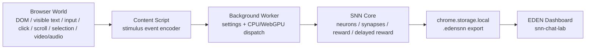
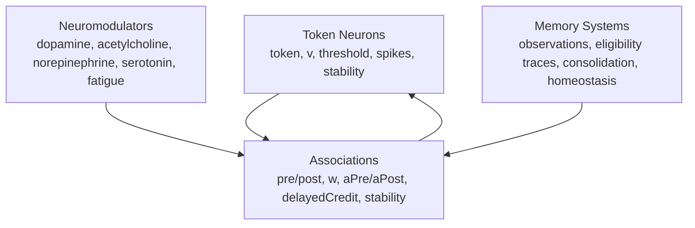

# Elfentier SNN Current Architecture

2026-06-23時点で実装済みのSNN学習環境の構造。

図解HTML: [snn-current-architecture.html](./snn-current-architecture.html)

## 全体フロー

## SNNモデル内部

## 学習ステップ

1. `Content Script` がブラウザ刺激をイベント化する。
2. `Background Worker` が学習設定を読み、CPU/WebGPU経路を決める。
3. `SNN Core` がイベントをトークン化する。
4. 語彙ニューロンを作成/更新する。`Max vocabulary = 0` なら語彙数は無制限。
5. 報酬、新奇性、顕著性、モラル評価、神経修飾を計算する。
6. STDP風に隣接トークン間のシナプス重みを更新する。
7. eligibility traceへ最近活動したシナプスを保存する。
8. 後続のクリック、選択、入力、動画完走などで遅延報酬を過去のシナプスへ割り当てる。
9. 恒常性可塑性と睡眠リプレイ風固定化で、発火しすぎや重要記憶を調整する。
10. モデルを `chrome.storage.local` に保存し、必要に応じて `.edensnn` として出力する。

## 実装済みコンポーネント

- `chrome-snn-extension/src/contentScript.js`: ブラウザ刺激の観測。
- `chrome-snn-extension/src/background.js`: 学習設定、保存、CPU/WebGPU dispatch。
- `chrome-snn-extension/src/snnCore.js`: SNN学習本体。
- `chrome-snn-extension/src/webgpuLearner.js`: WebGPU補助バックエンド。
- `chrome-snn-extension/src/sidepanel.*`: 設定、可視化、`.edensnn` export。
- `snn-chat-lab/`: 学習済み `.edensnn` との会話ツール。
- `EDEN/src/pages/SnnDashboard.tsx`: `.edensnn` 分析ダッシュボード。

## 観測できる刺激

- ページ表示: `page_view`
- 操作: `click`, `scroll`, `input`, `selection`
- メディア: `media_detected`, `media_play`, `media_sample`, `media_pause`, `media_seek`, `media_rate`, `media_volume`, `media_ended`
- 視覚: `visual_scan`, `autonomous_visual`, `text_visual`, `text_visual_caption`
- 抽象価値信号: `moral:harm-risk`, `moral:privacy-risk`, `moral:deception-risk`, `moral:consent-risk`, `moral:prosocial`

## 性能表示

サイドパネルには以下を表示する。

- `Model size`: JSON化したモデル概算容量。
- `CPU load`: 学習ステップ時間からの推定負荷。OS全体のCPU使用率ではない。
- `Step time`: 直近ステップ処理時間。
- `Avg step`: 移動平均処理時間。
- `Backend`: `cpu` または `webgpu`。
- `WebGPU`: WebGPU利用可否。

## 現時点の制限

- 音声波形の文字起こしは未実装。
- 映像フレーム解析は16x16低解像度特徴スパイクとして実装済み。全ピクセル保存や高精度物体認識は未実装。
- OS全体のCPU使用率はChrome拡張APIでは取得していない。
- WebGPUは膜電位更新の補助まで。全STDP更新のGPU化は未実装。
- EDEN Three.js身体SNNとの完全な統合は別系統。
